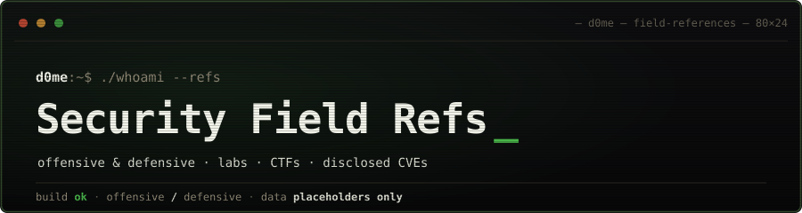

Field notes from both sides of security. Originally a notebook for myself,
published in case someone stuck on the same problem finds a shortcut.

攻撃・防御両面の実務ノート。ラボ・CTF・公開 CVE の再現を通じた記録。

---

### Refs — offensive security cheat sheets

Terminal-style references covering enumeration, Active Directory, privilege
escalation, lateral movement, web, and evasion / C2 tradecraft — the ground
most offensive certifications and lab-heavy study paths cover. Built from lab
work and disclosed CVEs. Every technique carries its detection and mitigation side.

列挙・AD・権限昇格・横展開・web・回避 / C2 を横断する実務リファレンス。
各手法に検知・緩和の観点を併記している。

Start with the cheat sheets → https://d0me-d0me.github.io

### Focus

`AD exploitation` · `AV/EDR evasion` · `process injection`
`AMSI / CLM bypass` · `lateral movement` · `C2 ops` · `custom C#/.NET tradecraft`

### Certifications

- `OSCP` — OffSec
- `OSEP` — OffSec
- `CPTS` — Hack The Box
- `SAL1` — TryHackMe
- `CySA+` — CompTIA
- `CCNA` — Cisco

### Repositories

- [`d0me-d0me.github.io`](https://github.com/d0me-d0me/d0me-d0me.github.io) — source for the field references site

---

我以外皆我師 — everyone I meet has something to teach me.
